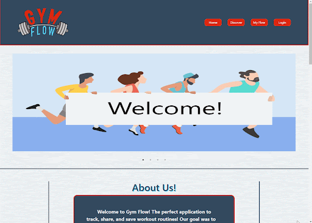
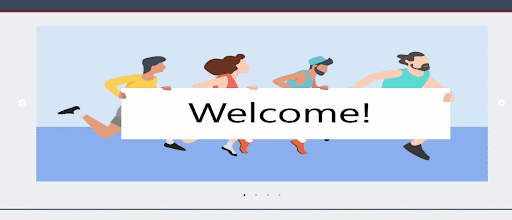
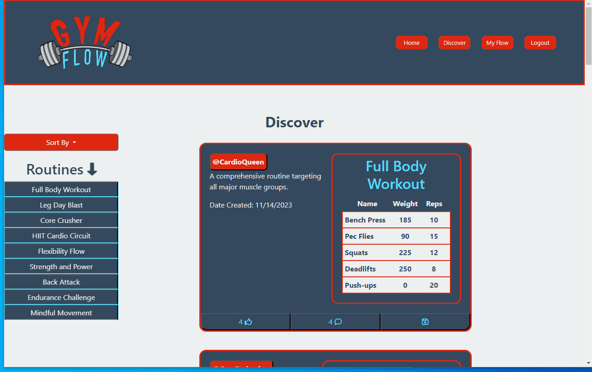
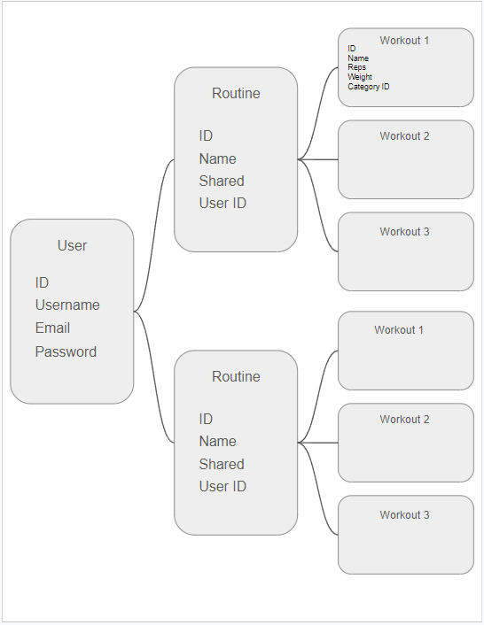
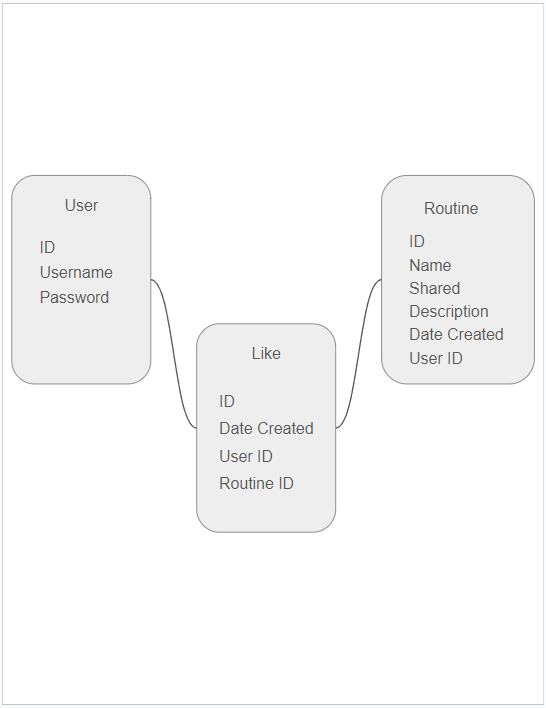
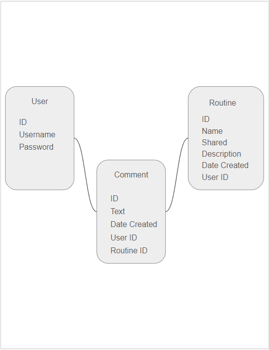
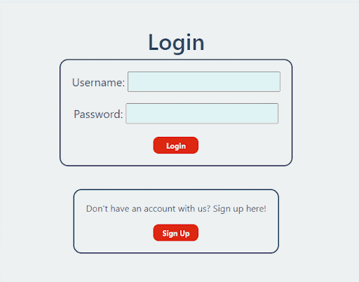
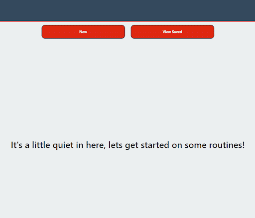
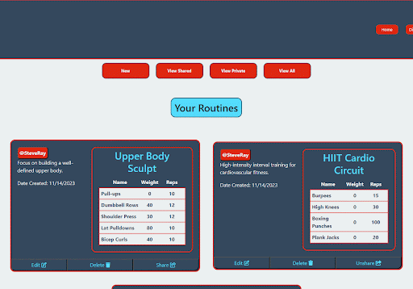
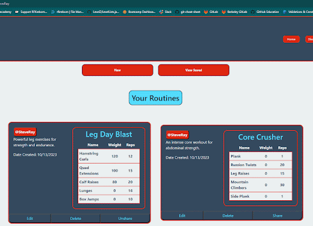

[](https://opensource.org/licenses/ISC)

  # Gym Flow

  ## Description

  Gym Flow is an application for keeping track, creating and sharing your workout routines with other users. A user can login or sign up on the website to gain access to creating and editing their own workout routines. An user can also go to a viewing page to view and save other user's workouts for their own use. The workouts can be created from scratch or use another individual's workout as inspiration to design the perfect routine for the user. Each workout can be shared by the author to allow others to view and potentially save it on their own account.

  

  ## Table of Contents

  - [Technologies](#technologies)
  - [User Stories](#user-stories)
  - [Installation](#installation)
  - [Usage](#usage)
  - [Credits](#credits)
  - [License](#license)
  - [Contributing](#contributing)
  - [Tests](#tests)

  ## Technologies

  ### FrontEnd
  - HTML
  - CSS
  - Javascript
  - Fetch
  - Foundation CSS Framework
  - Slick CSS Framework
  - Session Storage

  ### BackEnd
  - Node
  - NPM
  - Express
  - Express Session
  - Cookies
  - MySQL
  - Sequelize ORM  
  - Bcrypt
  - Handlebars

  ### CSS Implementation

  Slick and Foundation were used for this project. Slick was used mainly for the carousel, but Foundation was used to style everything else in the application. Foundation is a css framework similar to bootstrap and can be found [here](https://get.foundation/sites/docs/)

  

  

  ### Database Models

  

  

  

  ## User Stories

  - I want to be able to create a user profile that stores my username, email and password:

  

  ``` js
  router.post('/signup', async (req, res) => {
    try {
      const userData = await User.create(req.body);

      req.session.save(() => {
        req.session.user_id = userData.id;
        req.session.logged_in = true;

        res.status(200).json({ success: true, data: userData});
      });
    } catch (err) {
      res.status(400).json({ success: false, error: err.message });
    }
  });
  ```

  - I want to be able to create a workout table for each workout:

  

  ```js
  router.post('/', withAuth, async (req, res) => {
    try {
        const postRoutine = await Routine.create({
            routine_name: req.body.routine_name,
            share: req.body.share,
            description: req.body.description,
            user_id: req.session.user_id,
        });
        res.status(200).json(postRoutine);
    } catch (err) {
        res.status(500).json(err)
    }
  });
  ```
  - I want to be able to add a specific workout to each workout table:

  ```js
  // POST route to create an exercise
  router.post('/', withAuth, async (req, res) => {
    try {
      const newExercise = await Exercise.create({
        name: req.body.name,
        weight: req.body.weight,
        reps: req.body.reps,
        routine_id: req.body.routine_id
      });

      res.status(201).json({ success: true, data: newExercise });
    } catch (err) {
      res.status(400).json({ success: false, error: err.message });
    }
  });
  ```

  - I want to be able to update or delete my workout tables:

  

  ```js
  router.post('/', withAuth, async (req, res) => {
    try {
        const postRoutine = await Routine.create({
            routine_name: req.body.routine_name,
            share: req.body.share,
            description: req.body.description,
            user_id: req.session.user_id,
        });
        res.status(200).json(postRoutine);
    } catch (err) {
        res.status(500).json(err)
    }
  });
  ```
  ```js
  router.delete('/:id', withAuth, async (req, res) => {
    try {
        const findRoutine = await Routine.findByPk(req.params.id);
        await findRoutine.destroy();
        res.status(200).json({ message: "Routine Deleted!" })
    } catch (err) {
        res.status(500).json(err);
    }
  });
  ```

  - I want to be able to share my workout tables with other users:

  

  ```js
  // PUT route to share a routine
  router.put('/share/:routineId', withAuth, async (req, res) => {
    try {
        const userId = req.session.user_id;
        const routineId = req.params.routineId;

        const routine = await Routine.findOne({
            where: {
                id: routineId,
                user_id: userId,
            },
        });

        if (!routine) {
            // routine not found or doesn't belong to current user
            return res.status(404).json({ success: false, message: 'Routine not found or unauthorized.'})
        }

        // update share to true
        await routine.update({ share: true });

        return res.status(200).json({ success: true, message: 'Routine shared successfully.'});
    } catch (err) {
        console.error('Error sharing routine:', err);
        return res.status(500).json({ message: 'Internal server error.' });
    }
  });
  ```

  ## Installation

  To install this project on your local machine, clone the repository to your local machine via your terminal. Once the repo has been cloned, run the following command in your terminal to install all of the needed dependencies: 
  ```
  npm i
  ```
  Once that is finished, create a file called '.env' and enter the following code:
  ```
  DB_NAME='museum_db'
  DB_USER=''
  DB_PASSWORD=''
  ```
  Enter your user name and password within that file in the empty spaces. After saving the file run the following in your terminal to have the initial data be seeded into the database:
  ```
  npm run seed
  ```
  Once the data has been seeded the user can then start the server. Each time your wish to start the server, simply run the following code in your terminal:
  ```
  npm start
  ```
  With the server up and running on your local machine you can then navigate to http://localhost:3001/ to visit the website that is being run from your local server.

  ## Usage

  To use this project, either navigate [here](https://sheltered-inlet-69891-1c93b8a30eb8.herokuapp.com/) for the officially deployed link, or if you installed the application on your own system then navigate to http://localhost:3001/. From the home page, the user can see a carousel of other user's workouts on display as well as a short description of the website. From there the user can either sign in, sign up, or go straight to the discovery page. Should the user have an account and be logged in, the user gains access to a few more options. A user once logged in can create their own workout routines or edit the ones they have already created. The user has the power to edit or delete any of their workouts at any time. Should a user navigate to the discovery page, they can then scroll through all the other routines created by other individuals using the site. Any one of these workouts can be saved to later be edited or used. Should a user finish any editing or saving they can then logout for the day, and all of their workout routines will persist and be saved for the next login.

  ## Credits

  This project was designed by David Wright, Michael Reickerd and James Waller Jr. David's Github profile can be found [here](https://github.com/d-a-v-i-d-w-r-i-g-h-t), Michael's Github profile can be found [here](https://github.com/Migsrkrd), and James' Github profile can be found [here](https://github.com/DistantDig).

  ## License

  This project is covered under the ISC license. The full documentation on this license can be found [here](https://opensource.org/license/isc-license-txt/)

  ## Contributing

  Feel free to fork the project and create pull requests! Any ideas or contributions are welcome and appreciated!

  ## Tests

  No automatic methods of testing are included in this project, however feel free to fork the project and add some! Otherwise feel free to just experiment with the project and create issues for any odd behavior.